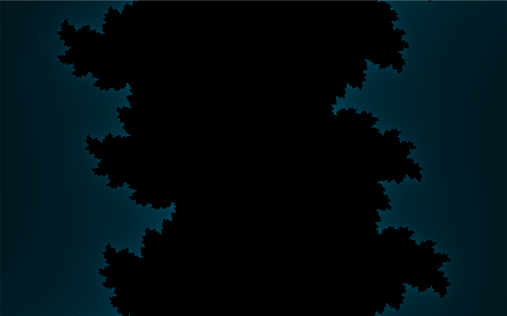
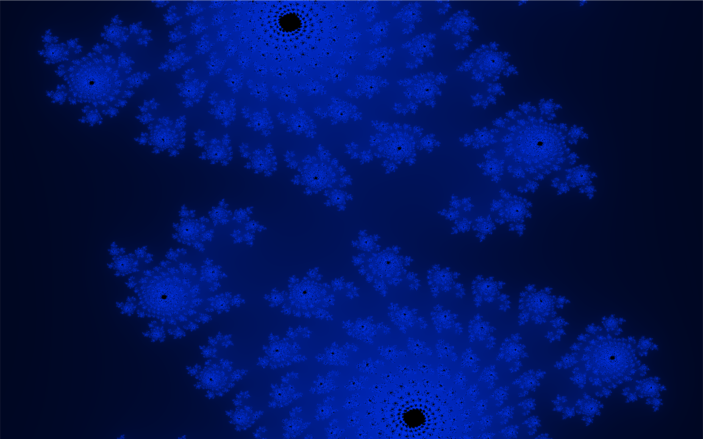

# SHFLA (Shoegaze Hierarchical Fractal Language Architecture)

**Author:** Shresht Bhowmick  
**Date:** November 2024

---


## Introduction

SHFLA (Shoegaze Hierarchical Fractal Language Architecture) takes my obsessions with music and fractal geometry and mashes them into a wild audiovisual playground. It’s a system that maps musical elements to dynamic Julia set fractals, producing visuals that adapt to the mood and energy of the song. Designed to be Turing-complete, SHFLA made its debut at the MIT Media Lab Unconventional Computing Hackathon and snagged first place for turning audio into stunning real-time fractal art.

The example video above demonstrates SHFLA with My Bloody Valentine’s *Only Shallow* (heavily compressed, but you get the vibe). Locally, it’s sharper, punchier, and absolutely mesmerizing.

---

## Features

- **Real-Time Visuals**: Synchronizes Julia set fractals with the audio playback.
- **Dynamic Parameter Mapping**:
  - **Brightness**: Mapped to the spectral centroid (perceived brightness).
  - **Color**: Directly tied to the musical key via chroma analysis.
  - **Complexity**: Influenced by the spectral centroid, scaling fractal intricacy.
- **Interactive Inputs**: Accepts song names or YouTube links.
- **Optimized Performance**: GPU acceleration via Numba and CUDA ensures buttery-smooth visuals.

---

## How It Works

### 1. Audio Input
- Enter a song name or a YouTube link.
- Audio is fetched using `yt-dlp`.

### 2. Feature Extraction
- **Pitch (Fundamental Frequency)**: Sets the complex parameter `c` for the Julia set.
- **Spectral Centroid**: Adjusts fractal complexity, e.g., `max_iter`.
- **Chroma Features**: Maps pitch classes to the fractal’s color palette.

### 3. Fractal Generation
- GPU-accelerated Julia set rendering in real-time.
- Dynamic parameter updates ensure seamless synchronization with music.

### 4. Visualization
- Pygame handles rendering and real-time interaction.

---

## Installation

### Prerequisites

- **Python 3.9+**
- **pip**
- **ffmpeg** in system PATH

### Python Dependencies

Install via `requirements.txt`:

```bash
git clone https://github.com/Tetraslam/SHFLA.git
cd SHFLA
pip install -r requirements.txt
```

Or install manually:

```bash
pip install numpy pygame librosa numba yt-dlp rich
```

### ffmpeg Installation

- **Windows**: [ffmpeg.org](https://ffmpeg.org/download.html#build-windows)
- **macOS**: `brew install ffmpeg`
- **Linux**: `sudo apt-get install ffmpeg`

Ensure ffmpeg is added to your PATH.

---

## Usage

1. **Run SHFLA**:
   ```bash
   python main.py
   ```

2. **Provide Input**:
   Enter a song name or YouTube link when prompted.

3. **Adjust Resolution (Optional)**:
   Specify a resolution or press Enter for default (1920x1080).

4. **Enjoy the Show**:
   Watch as SHFLA transforms music into fractals in real time.

---

## Examples

### Brightness Mapping

*Fractal changes driven by audio brightness.*

### Complexity Dynamics

*Fractal detail scaling with spectral richness.*

---

## System Requirements

- **OS**: Windows/macOS/Linux
- **Python**: 3.9+
- **Hardware**:
  - CUDA-enabled GPU (recommended)
  - 8GB+ RAM

---

## Contributing

Pull requests are welcome!

1. **Fork the Repo**
2. **Create a Feature Branch**:
   ```bash
   git checkout -b feature/new-feature
   ```
3. **Push Changes**:
   ```bash
   git push origin feature/new-feature
   ```
4. **Submit a Pull Request**

---

## License

**MIT License**. Feel free to modify and distribute.

---

## Acknowledgments

Special thanks to the Python community and everyone who’s ever stared too long at a fractal. Extra shoutout to Numba, CUDA, and the shoegaze genre for inspiration.

---

## Contact

Questions or ideas? Hit me up:

- **Email**: [bhowmick.sh@northeastern.edu](mailto:bhowmick.sh@northeastern.edu)
- **GitHub**: [Tetraslam](https://github.com/Tetraslam)
- **Website**: [tetraslam.world](https://tetraslam.world)
