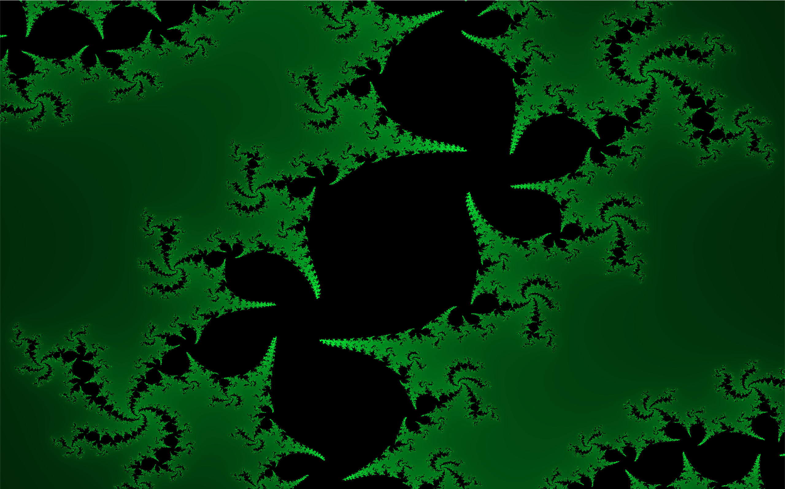

# SHFLA (Shoegaze Hierarchical Fractal Language Architecture)

**Author:** Shresht Bhowmick  
**Date:** November 2024

---

## Introduction

Hey there! I'm thrilled to introduce SHFLA (Shoegaze Hierarchical Fractal Language Architecture). This project blends my passion for music and fractal geometry by transforming any song into dynamic Julia set fractals, creating an immersive audiovisual experience. By mapping elements like pitch and brightness to fractal parameters, SHFLA brings your music to vibrant life. Designed to be Turing-complete, SHFLA was developed for the MIT Media Lab Unconventional Computing Hackathon, where it won first place. Dive in and watch your music inspire stunning mathematical art!

---

## Features

- **Real-Time Music Visualization**: Generates dynamic Julia set fractals synchronized with the input music.
- **Feature Mapping**:
  - **Brightness**: Mapped to the spectral centroid (perceived brightness) of the audio.
  - **Color**: Derived from the musical key using chroma features.
  - **Fractal Complexity**: Adjusted based on the spectral centroid, influencing the intricacy of the fractal patterns.
- **Interactive Input**: Users can input any song name or YouTube link.
- **High Performance**: Utilizes GPU acceleration with Numba and CUDA for smooth visualization.

---

## How It Works

1. **Audio Input**:
   - The user inputs a song name or YouTube link.
   - The program downloads the audio using `yt-dlp`.

2. **Feature Extraction**:
   - **Pitch (Fundamental Frequency)**: Determines the complex parameter `c` for the Julia set.
   - **Spectral Centroid**: Influences fractal parameters like `max_iter` (complexity).
   - **Chroma (Pitch Class Profile)**: Maps to hue for coloring the fractal.

3. **Fractal Generation**:
   - Generates Julia set fractals using GPU acceleration with Numba and CUDA.
   - Parameters are updated in real-time based on extracted audio features.

4. **Visualization**:
   - Displays fractal images using Pygame.
   - Synchronizes visuals with audio playback.

---

## Installation

### Prerequisites

- **Python 3.9 or higher**
- **pip** package manager
- **ffmpeg** installed and added to system PATH
  - **Windows Users**: Download `ffmpeg` from [ffmpeg.org](https://ffmpeg.org/download.html#build-windows). After installation, add the `bin` folder to your system PATH. Setting the `--ffmpeg-location` flag may not work; ensure `ffmpeg` is accessible via PATH.

### Required Python Packages

- `numpy`
- `pygame`
- `librosa`
- `numba`
- `yt-dlp`
- `rich`

### Installation Steps

1. **Clone the Repository**:

   ```bash
   git clone https://github.com/Tetraslam/SHFLA.git
   cd SHFLA
   ```

2. **Install the Required Packages**:

   ```bash
   pip install -r requirements.txt
   ```

   If `requirements.txt` is not available, install packages manually:

   ```bash
   pip install numpy pygame librosa numba yt-dlp rich
   ```

3. **Install ffmpeg**:

   - **Windows**:
     - Download from [ffmpeg.org](https://ffmpeg.org/download.html#build-windows).
     - Extract the files and add the `bin` folder to your system PATH.
   - **macOS**:
     ```bash
     brew install ffmpeg
     ```
   - **Linux**:
     ```bash
     sudo apt-get install ffmpeg
     ```

---

## Usage

1. **Run the Program**:

   ```bash
   python main.py
   ```

2. **Enter Song Input**:

   When prompted, enter a song name or YouTube link:

   ```
   Enter song name or YouTube link [default is 'https://www.youtube.com/watch?v=FyYMzEplnfU']:
   ```

3. **Set Resolution (Optional)**:

   You can specify the window resolution or press Enter to use the default (1920x1080):

   ```
   Enter the resolution as width height (e.g., '1920 1080') or press Enter for default:
   ```

4. **Enjoy the Visualization**:

   The program will process the audio and display the fractal visualization synchronized with the music.

---

## Examples

### Visualization Screenshots

#### Brightness Mapping


*Figure 1: Fractal visualization showing brightness corresponding to the spectral centroid.*

#### Contrast Mapping


*Figure 2: Fractal visualization showing contrast related to Fourier complexity.*

#### Edge Smoothness and Complexity



*Figure 3: Fractal edges representing consonance and dissonance.*

---

## Requirements

- **Operating System**: Windows, macOS, or Linux
- **Python Version**: 3.9 or higher
- **Internet Connection**: Required for downloading audio
- **Hardware**:
  - **CUDA-Compatible GPU**: Recommended for optimal performance.
  - **Sufficient RAM**: For processing audio and graphics.

---

## Contributing

Contributions are welcome! Please follow these steps:

1. **Fork the Repository**

2. **Create a Feature Branch**:

   ```bash
   git checkout -b feature/your-feature-name
   ```

3. **Commit Your Changes**:

   ```bash
   git commit -am 'Add a new feature'
   ```

4. **Push to the Branch**:

   ```bash
   git push origin feature/your-feature-name
   ```

5. **Open a Pull Request**

---

## License

This project is licensed under the **MIT License**.

---

## Acknowledgments

- **Fractal Geometry**: Inspired by the work of Benoît Mandelbrot.
- **Python Community**: For the development of essential libraries.
- **Numba and CUDA**: For enabling high-performance computations.

---

## Contact

- **Shresht Bhowmick**: [Email](mailto:bhowmick.sh@northeastern.edu) | [GitHub](https://github.com/Tetraslam)

---

Feel free to reach out for any questions or collaboration opportunities!